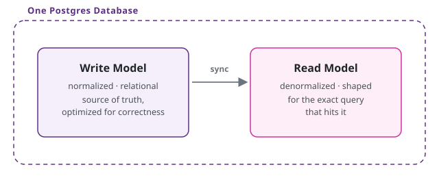
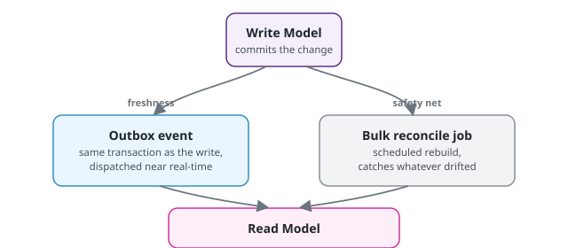

If you're planning to build a system and a developer or a vendor has already told you it needs to be microservices or NoSQL to be fast, this is worth reading before you sign off on that. I recently had the chance to sit in on a session on agentic AI coding, built around [a small ecommerce microservice MVP repo](https://github.com/mohammadeunus/ecommerce-microservice-mvp), the kind of session my workplace invests in so the team keeps learning. What stuck with me wasn't the coding lesson itself, but a side argument that came up along the way, one I've heard in some form from a lot of people over the years, and one you've likely already heard pitched to you: relational databases are the wrong default, because most systems are read-heavy, and relational schemas are optimized for writes.


**Short answer:** a normal relational database is the right starting point for most businesses. The read speed you actually need can come from a pattern called CQRS, inside your existing database, without adopting NoSQL or microservices. Skip to [A Simple Way to Decide](#a-simple-way-to-decide) if you just want the checklist.


## The Argument for NoSQL

The case usually goes like this: most systems see a read-to-write ratio somewhere around 9 to 1. If 90% of your traffic is reads, why build a schema that makes every one of those reads pay the cost of a join, in service of write guarantees the other 10% cares about?

A document store hands back the whole answer in one lookup. No join, no cost. Optimizing for the minority of your traffic, at the expense of the majority, looks backwards.

The ratio is real, and the cost of a join is real. Where I think this argument goes wrong isn't the math. It's stopping at the math, instead of asking who's actually running the system.

## The Question the Ratio Doesn't Answer

A slow read isn't automatically a defect. It's a design choice, and whether it's the *right* choice depends on something a read-write ratio can't tell you: what this specific business needs to be true about its data, and what it can actually afford to build.

For a lot of real products, especially early on, a join that costs a few extra milliseconds in exchange for data you can trust without question is a completely reasonable trade. A small team building something for a modest number of users doesn't have a scaling problem to solve yet.

It has a "keep this correct and cheap to build" problem, and a boring, normalized, standard relational schema is the right answer to that, not a compromise on the way to a better one. Reaching for NoSQL, CQRS, or microservices before that changes is solving a problem you don't have, at a cost you didn't need to pay.

It's also worth separating "relational is slower for reads" from "a monolith can't scale." A single Postgres-backed monolith can serve a public site with millions of users. When one specific read path (search is the classic example) genuinely gets slow, you pull just that piece out into something built for it, like Elasticsearch, and leave the rest of the system untouched.

That's not "NoSQL and specialized infrastructure are never the answer." It's "adopt the piece that solves the specific problem you actually have, once you have it, instead of re-architecting everything up front on the assumption that you eventually will."

None of that makes the original observation wrong. Reads genuinely are the majority of traffic in most systems, and joins genuinely are where that traffic pays a cost. The real question was never about the mechanism. It's about when paying to remove that cost is actually worth it.

## What's Actually Making NoSQL Reads Fast

Here's the mechanism itself, separated from the question of when to reach for it. A join is expensive because the database is assembling an answer at read time, out of pieces that were stored separately, on purpose, to keep the write side consistent. NoSQL document stores skip that cost on the read path by shaping the document like the answer ahead of time. Nothing gets assembled when you read it because it was already assembled when it was written.

That's the actual mechanism: shape the data for the read ahead of time, instead of assembling it on demand. NoSQL is one way to get that. It is not the only way, and it's not even the interesting decision.

## The More Expensive Question: Do You Need Microservices at All

The repo that session was built around was a microservices MVP, which is the other half of the same conversation. Microservices are usually sold on the same promise as NoSQL: each service owns its data, shaped exactly for what it needs, fast because nothing has to reach across a boundary at read time.

What that promise leaves out is the bill that comes with it:

- Independent deployments to coordinate.
- A network call (and its failure modes) where an in-process function call used to be.
- Distributed transactions or eventual consistency instead of a single database transaction.
- A team big enough to own separate services without stepping on each other.

Most products, in phase one, don't have the traffic, the team size, or the actual bounded contexts to justify any of that yet. It's the same shape of cost as the small team weighing NoSQL: you'd be paying an operational tax for a scaling problem you don't have.

This isn't a new take, either. Martin Fowler wrote about it in [MonolithFirst](https://martinfowler.com/bliki/MonolithFirst.html) back in 2015, and Shopify has [written publicly](https://shopify.engineering/shopify-monolith) about keeping their monolith modular at a scale most of us will never hit, instead of splitting it into services.

The pragmatic default is to start with a monolith (a modular one, if you want clean seams from day one) and change the architecture on demand when a real forcing function shows up: a module that genuinely needs to scale independently, a team that needs to own and deploy its own piece, a workload that's actively fighting the rest of the system for resources. A modular monolith with clean module boundaries also makes that later split cheap, because you're extracting a module that was already isolated, not untangling one that never had a boundary.

It's also worth noting how far "don't abandon Postgres too early" actually goes. OpenAI [wrote about scaling PostgreSQL](https://openai.com/index/scaling-postgresql/) to power ChatGPT's 800 million users: nearly 50 read replicas, connection pooling, and workload isolation, deliberately choosing not to shard or move off Postgres because that cost wasn't worth paying while a read-heavy workload still had headroom left to optimize. That's a different mechanism than the read-model split this post is about, but the same underlying instinct: reach for a more exotic piece of infrastructure only when the simpler one has genuinely run out of road, not before.

## The Part You Can Actually Borrow Now: CQRS

Here's where the two threads meet. The read-model trick that makes microservices and NoSQL feel fast doesn't require either one. It's CQRS: split your write model from your read model, and stop asking one schema to serve both jobs well.

- **Write model** stays normalized, relational, boring. It's the source of truth, optimized for correctness, not for how any particular screen wants to read it.
- **Read model** is one or more dedicated tables, denormalized on purpose, shaped exactly like the query that hits it. If a page needs order + customer + line items + shipping status in one read, that's the table: a snapshot of what those four tables looked like the moment it was built, instead of four tables and a join.

None of this requires a separate database, and it doesn't require microservices either. CQRS is a split between two *models*, not two pieces of infrastructure. Inside a monolith or a modular monolith, both models can live in the same Postgres database, even the same schema, as long as the read tables are clearly owned by the module that serves them. You split the physical infrastructure later, if a concrete reason shows up: read replica lag becomes a problem, read and write load need to scale independently, or a module is graduating into its own service anyway. Building the split in from day one is paying for a problem you don't have yet, same as reaching for microservices too early.

## Not Everything Belongs in a Snapshot

A snapshot is only correct as of whenever it was last projected, and that's not a free tradeoff for every field. Something like price is a good example: showing a customer a price that's a few seconds stale at checkout isn't a performance nuance, it's a business problem.

The rule of thumb is to denormalize what's expensive to assemble and tolerant of a little staleness, like an order summary or a dashboard aggregate, and leave volatile, authoritative fields like price or stock count out of the snapshot. Pull those live instead, either with a join (usually a cheap, indexed lookup against one table, not the multi-table join CQRS is trying to avoid) or a parallel call to the table or service that owns that fact. CQRS isn't "flatten everything." It's "flatten what's stable and expensive, keep what's volatile and load-bearing live."

## How You Keep the Read Model in Sync

A denormalized read table is a copy, and copies drift unless something keeps them honest. Two approaches cover most of it, and inside a monolith neither one needs a message broker:

- **Event-driven sync (real-time).** The write side records an event on every change, in an outbox table in the same transaction as the write, so the event only exists if the write actually committed. A background dispatcher (in-process, or a simple worker if you want it out of the request path) picks that event up and updates the affected read rows. Close to real-time, and what you want for anything user-facing.
- **Bulk sync (batch).** A scheduled job that rebuilds or reconciles the read tables from the source of truth, wholesale. Slower, heavier, and it's your safety net: if a projection has a bug, an event gets dropped, or a read table's shape changes, bulk sync gets you back to correct without a manual data-fix script.

You want both, not one or the other: event-driven sync for freshness, bulk sync as the reconciliation job that catches whatever drifted. Postgres gives you what you need for this without reaching for another system: an outbox table plus a worker for the event side, and a plain rebuild job (or a materialized view with a scheduled refresh) for the snapshot side. If a module later gets extracted into its own service, the outbox pattern is exactly what you swap a message broker into. The pattern doesn't change, only the transport does.

## The Trade You're Actually Making

None of this is free, in a monolith or anywhere else:

- Two schemas to reason about instead of one, and they can disagree with each other for a short window.
- Every projection needs to be idempotent, because event delivery will eventually retry or duplicate.
- You're storing some facts more than once, trading storage and write-side complexity for read-side speed on the data that's worth it.

That's the same trade NoSQL document stores make, and the same trade microservices make when each service keeps its own copy of data it doesn't own. The difference is you're making the trade explicitly, only where it earns its cost, and you're not also paying for a distributed system you don't need yet to get it.

## A Simple Way to Decide

If you're trying to figure out whether your product needs any of this, three plain questions cover most of it.

**1. Is a page or screen actually slow enough that customers notice?**
Don't guess. Measure it first. A lot of "slow" pages turn out to be fine once you check, and building a fix for a problem that doesn't exist yet just adds cost and complexity for nothing.

**2. Is it okay if this specific piece of data is a few seconds out of date?**
An order history or a dashboard number can usually be a few seconds stale with no real consequence. A price at checkout, or how much stock is left, cannot; get those wrong and it's a customer complaint or a financial problem, not a technical detail. If it's the first kind, it's a candidate for the speed-up in this post. If it's the second kind, leave it alone.

**3. Is there a real, current reason to split anything up, not just a "we might need to someday"?**
A real reason looks like: a specific team that needs to own and ship its own piece independently, or a part of the system that's genuinely struggling under load while the rest is fine. A hunch that you'll grow into it eventually is not a real reason. If you don't have one yet, keep everything as it is.

If the honest answer to all three is "not yet," that's not a compromise, it's the right call for where the business is today.

## Where This Leaves Me

I don't think relational databases are dying, and I don't think a 9:1 read-write ratio is a bad observation either. It's just an incomplete one on its own. The question it raises is worth asking. The answer isn't a database engine, or an architecture pattern you adopt on principle. It's a decision you make once you know what this specific system needs to be true about its data, and what the team building it can actually afford. Get fast reads with CQRS the moment a specific read earns it. Reach for NoSQL, or for microservices, only when something concrete forces your hand, not because a ratio said so.
